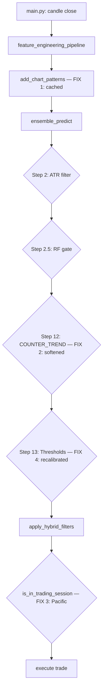

# Design Document: bot-performance-trading-fix

## Overview

This document covers the technical design for four targeted fixes to the trading bot that collectively prevent trade execution during normal operation. Each fix is surgical — minimal code changes with maximum impact — and is designed to be independently deployable.

The four defects and their root causes:

| # | Defect | Root Cause | Impact |
|---|--------|-----------|--------|
| 1 | PatternDetector processes 99,000 candles/cycle | No caching; full `for i in range(lookback, n)` loop on every call | Bot misses M5 candle closes |
| 2 | COUNTER_TREND_H1 hard-blocks all BUY signals during H1 downtrends | Step 12 in `ensemble_engine.py` returns HOLD unconditionally when `against_h1` is True | Zero BUY trades during any H1 downtrend |
| 3 | UNKNOWN session blocks off-hours trading (UTC 22–23) | `get_active_session()` returns `"UNKNOWN"` for hours 22–23; `is_in_trading_session()` falls through to `False` | No trades during Pacific/late-NY overlap |
| 4 | BUY threshold too high after isotonic calibration | Thresholds (0.62–0.64) were set for uncalibrated outputs; isotonic calibration compresses scores toward 0.5 | Valid signals like USDJPY@0.5994 are rejected |

---

## Architecture

The fixes touch four files. No new modules are introduced. All changes are backward-compatible.

```
config.py                    ← New config params for fixes 2, 3, 4
pattern_detector.py          ← Fix 1: per-symbol cache dict + incremental logic
ensemble_engine.py           ← Fix 2: soften COUNTER_TREND_H1 block
                             ← Fix 4: recalibrate thresholds, read from Config
trade_manager.py             ← Fix 3: add Pacific session to get_active_session()
                                       and is_in_trading_session()
```

Data flow is unchanged. The main loop in `main.py` requires no modifications.



---

## Components and Interfaces

### Fix 1 — PatternDetector Caching (`pattern_detector.py`)

**Problem:** `add_chart_patterns(df)` runs a `for i in range(lookback, n)` loop over the full DataFrame on every call. With `DATA_POINTS = 2000` and 6 symbols evaluated every 5 minutes, this is ~12,000 iterations per cycle, each calling `argrelextrema` and `_linear_slope`.

**Solution:** A module-level cache dict keyed by symbol. On each call, compare the current row count to the cached row count. If equal, return the cached result. If larger, recompute only the new rows using a bounded lookback window of 1000 candles.

**Cache structure:**
```python
# Module-level — persists across calls within the same process
_pattern_cache: dict[str, dict] = {}

# Per-symbol entry structure:
{
    "symbol_name": {
        "last_row_count": int,          # len(df) at last computation
        "last_index": int,              # df.index[-1] value (for integrity check)
        "columns": dict[str, np.ndarray]  # all 15 output column arrays
    }
}
```

**Revised function signature:**
```python
def add_chart_patterns(df: pd.DataFrame, symbol: str = "UNKNOWN") -> pd.DataFrame:
```

The `symbol` parameter is the cache key. Callers in `features.py` must pass the symbol name.

**Incremental logic:**
```python
CACHE_LOOKBACK = 1000  # max rows to reprocess on incremental update

def add_chart_patterns(df: pd.DataFrame, symbol: str = "UNKNOWN") -> pd.DataFrame:
    global _pattern_cache
    n = len(df)
    cached = _pattern_cache.get(symbol)

    # --- Cache hit: same row count ---
    if cached is not None and cached["last_row_count"] == n:
        logger.info("[Patterns][%s] Cache hit — %d rows, 0 new rows processed.", symbol, n)
        for col, arr in cached["columns"].items():
            df[col] = arr
        return df

    # --- Incremental update: new rows only ---
    if cached is not None and n > cached["last_row_count"]:
        new_rows = n - cached["last_row_count"]
        start_idx = max(0, n - CACHE_LOOKBACK)
        # ... compute only df[start_idx:n], merge with cached arrays
        logger.info("[Patterns][%s] Incremental — %d new rows processed (lookback=%d).",
                    symbol, new_rows, n - start_idx)
    else:
        # --- First call or cache invalidation: full computation ---
        logger.info("[Patterns][%s] Full computation — %d rows.", symbol, n)
        # ... existing rolling-window logic unchanged

    # Store result in cache
    _pattern_cache[symbol] = {
        "last_row_count": n,
        "last_index": df.index[-1],
        "columns": {col: df[col].values.copy() for col in OUTPUT_COLUMNS}
    }
    return df
```

**Output columns constant (used for cache storage and regression check):**
```python
OUTPUT_COLUMNS = [
    "DoubleTop_Flag", "DoubleBottom_Flag", "TripleTop_Flag", "TripleBottom_Flag",
    "HS_Flag", "InvHS_Flag", "AscTriangle_Flag", "DescTriangle_Flag",
    "SymTriangle_Flag", "RisingWedge_Flag", "FallingWedge_Flag",
    "BullFlag_Flag", "BearFlag_Flag", "Volatility_Compress", "pattern_bias_score"
]
```

---

### Fix 2 — COUNTER_TREND_H1 Softening (`ensemble_engine.py`)

**Problem:** Step 12 in `ensemble_predict()` contains a hard block:
```python
# v6.0: H1 counter-trend HARD BLOCK
against_h1 = (decision.side == "BUY" and h1_trend == -1) or (decision.side == "SELL" and h1_trend == 1)
if against_h1 and h1_trend != 0:
    decision.direction = None
    decision.decision_reason = "COUNTER_TREND_H1"
    ...
    return decision
```
This returns HOLD for 100% of counter-trend signals regardless of XGB confidence.

**Solution:** Replace the hard block with a conditional: if `xgb_prob >= COUNTER_TREND_XGB_OVERRIDE_THRESHOLD`, allow the signal through; otherwise apply a configurable score penalty.

**Exact replacement for Step 12 in `ensemble_predict()`:**
```python
# v6.1: H1 counter-trend SOFT BLOCK (replaces v6.0 hard block)
against_h1 = (decision.side == "BUY" and h1_trend == -1) or \
             (decision.side == "SELL" and h1_trend == 1)
override_threshold = getattr(Config, "COUNTER_TREND_XGB_OVERRIDE_THRESHOLD", 0.75)
ct_penalty = getattr(Config, "COUNTER_TREND_PENALTY", -0.04)

if against_h1 and h1_trend != 0:
    if xgb_prob >= override_threshold:
        # High-confidence counter-trend: allow through, log override
        logger.info(
            "[Ensemble v6.1] COUNTER_TREND OVERRIDE: %s vs H1=%d, xgb=%.4f >= %.2f -> PASS",
            decision.side, h1_trend, xgb_prob, override_threshold
        )
        mtf_penalty = 0.0  # no penalty for high-confidence override
    else:
        # Low-confidence counter-trend: apply penalty, do NOT hard block
        logger.info(
            "[Ensemble v6.1] COUNTER_TREND PENALTY: %s vs H1=%d, xgb=%.4f < %.2f -> penalty=%.4f",
            decision.side, h1_trend, xgb_prob, override_threshold, ct_penalty
        )
        mtf_penalty = ct_penalty  # e.g. -0.04
else:
    mtf_penalty = 0.0
```

Note: the dead code block immediately after the original hard block (the duplicate `against_h1` assignment and `mtf_penalty = -0.03`) must also be removed.

---

### Fix 3 — Pacific Session (`trade_manager.py` + `config.py`)

**Problem:** `get_active_session()` returns `"UNKNOWN"` for UTC hours 22–23. `is_in_trading_session()` falls through to `return False, "Outside all sessions..."`. The `apply_hybrid_filters()` in `main.py` then rejects the signal with `SESSION: Outside all sessions`.

**Config additions (`config.py`):**
```python
# Pacific Session (UTC 22-24 — late NY overlap / early Asia pre-market)
SESSION_PACIFIC = (22, 24)          # UTC hour range (24 = midnight boundary)
TRADE_SESSION_PACIFIC = True        # Enable trading during Pacific session
PACIFIC_POSITION_SIZE_MODIFIER = 0.5  # 50% size — reduced liquidity
```

**`get_active_session()` change:**
```python
@staticmethod
def get_active_session(symbol=None):
    hour = datetime.datetime.utcnow().hour
    if Config.SESSION_LONDON[0] <= hour < Config.SESSION_LONDON[1]:
        return "London"
    if Config.SESSION_NY[0] <= hour < Config.SESSION_NY[1]:
        return "New York"
    if Config.SESSION_ASIA[0] <= hour < Config.SESSION_ASIA[1]:
        return "Asia"
    # NEW: Pacific session covers UTC 22-23 (hour 24 wraps to 0 = Asia)
    pacific_start, pacific_end = getattr(Config, "SESSION_PACIFIC", (22, 24))
    if pacific_start <= hour or hour < (pacific_end % 24):
        return "Pacific"
    return "UNKNOWN"
```

**`is_in_trading_session()` change — add Pacific branch before the fallthrough:**
```python
pacific = getattr(Config, "SESSION_PACIFIC", (22, 24))
pacific_start, pacific_end = pacific
in_pacific = pacific_start <= hour or hour < (pacific_end % 24)

if in_pacific and getattr(Config, "TRADE_SESSION_PACIFIC", True):
    return True, f"In Pacific session (UTC Hour: {hour})"
if in_pacific and not getattr(Config, "TRADE_SESSION_PACIFIC", True):
    return False, f"In Pacific session, but trading is disabled for this session (UTC Hour: {hour})"
```

**Position size modifier:** In `TradeManager.calculate_lot_size()` (or wherever lot sizing is computed), apply the modifier when session is Pacific:
```python
session = TradeManager.get_active_session()
if session == "Pacific":
    size_modifier = getattr(Config, "PACIFIC_POSITION_SIZE_MODIFIER", 0.5)
    lot_size = lot_size * size_modifier
```

**`_compute_session_bonus()` change in `ensemble_engine.py`:**
```python
elif session == "Pacific":
    raw_bonus = 0.0  # neutral — no bonus, no penalty
```

---

### Fix 4 — Threshold Recalibration (`ensemble_engine.py` + `config.py`)

**Problem:** Step 13 in `ensemble_predict()` uses hardcoded thresholds (0.62–0.64 for BUY, 0.36–0.38 for SELL) that were set before isotonic calibration was applied. Isotonic calibration compresses XGB outputs toward 0.5, so the effective signal range is now ~0.52–0.60, making the old thresholds unreachable.

**Config additions (`config.py`):**
```python
# Recalibrated thresholds (post-isotonic-calibration)
PROB_THRESHOLD_BUY_RANGING      = 0.58   # trend_strength <= 0.25
PROB_THRESHOLD_BUY_TRANSITIONING = 0.57  # 0.25 < trend_strength <= 0.35
PROB_THRESHOLD_BUY_TRENDING     = 0.56   # trend_strength > 0.35

PROB_THRESHOLD_SELL_RANGING      = 0.42  # trend_strength <= 0.25
PROB_THRESHOLD_SELL_TRANSITIONING = 0.43 # 0.25 < trend_strength <= 0.35
PROB_THRESHOLD_SELL_TRENDING     = 0.44  # trend_strength > 0.35
```

**Step 13 replacement in `ensemble_predict()`:**
```python
# Step 13: Recalibrated thresholds (v6.1 — post-isotonic-calibration)
if diagnostic:
    buy_threshold  = 0.62   # unchanged for diagnostic mode comparisons
    sell_threshold = 0.38
else:
    if trend_strength > 0.35:
        buy_threshold  = getattr(Config, "PROB_THRESHOLD_BUY_TRENDING", 0.56)
        sell_threshold = getattr(Config, "PROB_THRESHOLD_SELL_TRENDING", 0.44)
    elif trend_strength > 0.25:
        buy_threshold  = getattr(Config, "PROB_THRESHOLD_BUY_TRANSITIONING", 0.57)
        sell_threshold = getattr(Config, "PROB_THRESHOLD_SELL_TRANSITIONING", 0.43)
    else:
        buy_threshold  = getattr(Config, "PROB_THRESHOLD_BUY_RANGING", 0.58)
        sell_threshold = getattr(Config, "PROB_THRESHOLD_SELL_RANGING", 0.42)
```

---

## Data Models

### PatternDetector Cache Entry
```python
@dataclass
class PatternCacheEntry:
    last_row_count: int          # len(df) when cache was last written
    last_index: Any              # df.index[-1] — integrity check
    columns: dict[str, np.ndarray]  # 15 output column arrays (copies)
```

### Config Parameters Added
| Parameter | Type | Default | Fix |
|-----------|------|---------|-----|
| `COUNTER_TREND_XGB_OVERRIDE_THRESHOLD` | float | 0.75 | 2 |
| `COUNTER_TREND_PENALTY` | float | -0.04 | 2 |
| `SESSION_PACIFIC` | tuple | (22, 24) | 3 |
| `TRADE_SESSION_PACIFIC` | bool | True | 3 |
| `PACIFIC_POSITION_SIZE_MODIFIER` | float | 0.5 | 3 |
| `PROB_THRESHOLD_BUY_RANGING` | float | 0.58 | 4 |
| `PROB_THRESHOLD_BUY_TRANSITIONING` | float | 0.57 | 4 |
| `PROB_THRESHOLD_BUY_TRENDING` | float | 0.56 | 4 |
| `PROB_THRESHOLD_SELL_RANGING` | float | 0.42 | 4 |
| `PROB_THRESHOLD_SELL_TRANSITIONING` | float | 0.43 | 4 |
| `PROB_THRESHOLD_SELL_TRENDING` | float | 0.44 | 4 |

---

## Correctness Properties

*A property is a characteristic or behavior that should hold true across all valid executions of a system — essentially, a formal statement about what the system should do. Properties serve as the bridge between human-readable specifications and machine-verifiable correctness guarantees.*

### Property 1: Cache correctness — cached results equal fresh results

*For any* valid OHLC DataFrame and any symbol, calling `add_chart_patterns(df, symbol)` twice with the same DataFrame must produce identical values in all 15 output columns. The second call must be served from cache.

**Validates: Requirements 1.1, 1.5**

---

### Property 2: Incremental correctness — previously computed rows are unchanged

*For any* valid OHLC DataFrame extended with one or more new rows, calling `add_chart_patterns` on the extended DataFrame must produce the same pattern flag values for all rows that existed in the original DataFrame as a fresh (no-cache) call would produce.

**Validates: Requirements 1.2, 1.5**

---

### Property 3: Output completeness — all 15 columns always present

*For any* valid OHLC DataFrame with at least 50 rows and an `ATR` column, `add_chart_patterns()` must return a DataFrame containing all 15 expected columns: the 14 pattern flag columns and `pattern_bias_score`.

**Validates: Requirements 1.8**

---

### Property 4: Cache isolation — per-symbol independence

*For any* two distinct symbol names and two distinct OHLC DataFrames, calling `add_chart_patterns` for symbol A must not alter the cached result for symbol B.

**Validates: Requirements 1.6**

---

### Property 5: High-confidence counter-trend signals are not hard-blocked

*For any* ensemble evaluation where the proposed direction opposes the H1 trend (`against_h1 = True`) and `xgb_prob >= COUNTER_TREND_XGB_OVERRIDE_THRESHOLD`, the `decision_reason` must not be `"COUNTER_TREND_H1"` and the signal must proceed to the threshold check step.

**Validates: Requirements 2.1, 2.2**

---

### Property 6: Low-confidence counter-trend signals receive penalty, not hard block

*For any* ensemble evaluation where the proposed direction opposes the H1 trend and `xgb_prob < COUNTER_TREND_XGB_OVERRIDE_THRESHOLD`, the `decision_reason` must not be `"COUNTER_TREND_H1"` (no hard block), and the `final_prob` must be lower than it would be without the counter-trend penalty by exactly `|COUNTER_TREND_PENALTY|`.

**Validates: Requirements 2.3, 2.4, 2.10**

---

### Property 7: Pacific session detection covers all UTC 22–23 hours

*For any* UTC hour value in {22, 23}, `TradeManager.get_active_session()` must return `"Pacific"`.

**Validates: Requirements 3.1**

---

### Property 8: Pacific session trading respects the TRADE_SESSION_PACIFIC flag

*For any* call to `is_in_trading_session()` during UTC hours 22–23, the return value must be `(True, ...)` if and only if `TRADE_SESSION_PACIFIC` is `True`.

**Validates: Requirements 3.2, 3.8**

---

### Property 9: Pacific session bonus is always zero

*For any* value of `trend_strength` in [0.0, 1.0], `_compute_session_bonus("Pacific", trend_strength)` must return `0.0`.

**Validates: Requirements 3.5**

---

### Property 10: Existing session detection is unchanged

*For any* UTC hour in [7, 16), `get_active_session()` must return `"London"`. *For any* UTC hour in [13, 22), `get_active_session()` must return `"New York"` (unless also in London range, where London takes priority). *For any* UTC hour in [0, 9), `get_active_session()` must return `"Asia"`.

**Validates: Requirements 3.9**

---

### Property 11: BUY threshold matches the correct tier for all trend_strength values

*For any* `trend_strength` value in [0.0, 1.0] and `diagnostic=False`, the `buy_threshold` selected by `ensemble_predict` must equal `PROB_THRESHOLD_BUY_RANGING` when `trend_strength <= 0.25`, `PROB_THRESHOLD_BUY_TRANSITIONING` when `0.25 < trend_strength <= 0.35`, and `PROB_THRESHOLD_BUY_TRENDING` when `trend_strength > 0.35`.

**Validates: Requirements 4.1, 4.2, 4.3**

---

### Property 12: SELL threshold matches the correct tier for all trend_strength values

*For any* `trend_strength` value in [0.0, 1.0] and `diagnostic=False`, the `sell_threshold` selected by `ensemble_predict` must equal `PROB_THRESHOLD_SELL_RANGING` when `trend_strength <= 0.25`, `PROB_THRESHOLD_SELL_TRANSITIONING` when `0.25 < trend_strength <= 0.35`, and `PROB_THRESHOLD_SELL_TRENDING` when `trend_strength > 0.35`.

**Validates: Requirements 4.4, 4.5, 4.6**

---

## Error Handling

### Fix 1 — Cache Invalidation
- If `df.index[-1]` differs from `cached["last_index"]` but row count is the same (symbol data was replaced), treat as a cache miss and recompute fully.
- If `n < cached["last_row_count"]` (DataFrame shrank — e.g., data reload), invalidate the cache entry and recompute fully.
- Cache entries are never persisted to disk; a bot restart always starts with a cold cache (first call does full computation, which is acceptable).

### Fix 2 — Counter-Trend Override
- If `Config.COUNTER_TREND_XGB_OVERRIDE_THRESHOLD` is missing (old config), `getattr` defaults to `0.75` — behavior is safe.
- If `Config.COUNTER_TREND_PENALTY` is missing, defaults to `-0.04` — behavior is safe.
- The penalty is applied to `base_score` before the additive scoring step, so it is bounded by the existing `np.clip(base_score, 0.0, 1.0)` call.

### Fix 3 — Pacific Session
- The Pacific session range `(22, 24)` uses `hour < (pacific_end % 24)` to handle the midnight boundary correctly (`24 % 24 == 0`, so `hour < 0` is always False — Pacific covers only hours 22 and 23, not hour 0 which belongs to Asia).
- If `SESSION_PACIFIC` is missing from Config, `getattr` defaults to `(22, 24)`.
- If `TRADE_SESSION_PACIFIC` is missing, defaults to `True` (safe — enables trading).

### Fix 4 — Threshold Recalibration
- All threshold params use `getattr(Config, ..., default)` so old config files without the new params continue to work with the new default values.
- Diagnostic mode thresholds are hardcoded (not read from Config) to preserve backward compatibility of diagnostic comparisons.

---

## Testing Strategy

### Unit Tests

Each fix should have targeted unit tests covering:

**Fix 1 — PatternDetector:**
- Cache hit: call twice with same DataFrame, assert second call returns identical columns and logs "Cache hit"
- Incremental update: call with N rows, then N+5 rows, assert old rows unchanged
- Full computation: call with no prior cache, assert all 15 columns present
- Cache isolation: call for symbol A, then symbol B, assert independent cache entries
- Performance: time a 2000-row call, assert < 2.0 seconds

**Fix 2 — Counter-Trend:**
- High-confidence override: `h1_trend=-1`, `xgb_prob=0.80`, BUY side → `decision_reason != "COUNTER_TREND_H1"`
- Low-confidence penalty: `h1_trend=-1`, `xgb_prob=0.60`, BUY side → `decision_reason != "COUNTER_TREND_H1"`, `final_prob` reduced
- Neutral trend: `h1_trend=0` → no penalty applied
- Diagnostic mode: verify override/penalty logic still applies in diagnostic mode

**Fix 3 — Pacific Session:**
- `get_active_session()` at hour 22 → `"Pacific"`
- `get_active_session()` at hour 23 → `"Pacific"`
- `is_in_trading_session()` with `TRADE_SESSION_PACIFIC=True` at hour 22 → `(True, ...)`
- `is_in_trading_session()` with `TRADE_SESSION_PACIFIC=False` at hour 22 → `(False, "...disabled...")`
- `_compute_session_bonus("Pacific", 0.0)` → `0.0`
- `_compute_session_bonus("Pacific", 0.8)` → `0.0`
- Existing sessions unchanged: hour 8 → London, hour 14 → New York, hour 3 → Asia

**Fix 4 — Thresholds:**
- `trend_strength=0.10` → `buy_threshold=0.58`, `sell_threshold=0.42`
- `trend_strength=0.30` → `buy_threshold=0.57`, `sell_threshold=0.43`
- `trend_strength=0.50` → `buy_threshold=0.56`, `sell_threshold=0.44`
- `diagnostic=True` → `buy_threshold=0.62`, `sell_threshold=0.38` (unchanged)
- Signal at `final_prob=0.59` with `trend_strength=0.10` → direction=BUY (previously rejected)

### Property-Based Tests

The property-based testing library for this project is **Hypothesis** (Python). Each property test runs a minimum of 100 iterations.

**Property 1 — Cache correctness:**
```python
# Feature: bot-performance-trading-fix, Property 1: cached results equal fresh results
@given(df=ohlc_dataframe_strategy(), symbol=st.text(min_size=1, max_size=10))
@settings(max_examples=100)
def test_cache_correctness(df, symbol):
    clear_cache(symbol)
    result1 = add_chart_patterns(df.copy(), symbol)
    result2 = add_chart_patterns(df.copy(), symbol)
    for col in OUTPUT_COLUMNS:
        assert_array_equal(result1[col].values, result2[col].values)
```

**Property 3 — Output completeness:**
```python
# Feature: bot-performance-trading-fix, Property 3: all 15 columns always present
@given(df=ohlc_dataframe_strategy(min_rows=50))
@settings(max_examples=100)
def test_output_completeness(df):
    result = add_chart_patterns(df, symbol="TEST")
    for col in OUTPUT_COLUMNS:
        assert col in result.columns
```

**Property 5 — High-confidence counter-trend not blocked:**
```python
# Feature: bot-performance-trading-fix, Property 5: high-confidence counter-trend signals pass
@given(
    xgb_prob=st.floats(min_value=0.75, max_value=0.99),
    h1_trend=st.sampled_from([-1, 1]),
    ...
)
@settings(max_examples=100)
def test_high_confidence_counter_trend_not_blocked(xgb_prob, h1_trend, ...):
    decision = ensemble_predict(xgb_prob=xgb_prob, ..., h1_trend=h1_trend)
    assert decision.decision_reason != "COUNTER_TREND_H1"
```

**Property 11 — BUY threshold tier selection:**
```python
# Feature: bot-performance-trading-fix, Property 11: BUY threshold matches tier
@given(trend_strength=st.floats(min_value=0.0, max_value=1.0))
@settings(max_examples=200)
def test_buy_threshold_tier(trend_strength):
    # Inject trend_strength via ADX (trend_strength = clip((adx-15)/35, 0, 1))
    adx = trend_strength * 35 + 15
    decision = ensemble_predict(..., current_adx=adx, diagnostic=False)
    if trend_strength <= 0.25:
        assert decision.buy_threshold == Config.PROB_THRESHOLD_BUY_RANGING
    elif trend_strength <= 0.35:
        assert decision.buy_threshold == Config.PROB_THRESHOLD_BUY_TRANSITIONING
    else:
        assert decision.buy_threshold == Config.PROB_THRESHOLD_BUY_TRENDING
```

### Integration Verification

After deploying all four fixes, verify against live logs:
1. PatternDetector log lines show "Cache hit" on second call per symbol per cycle
2. No `COUNTER_TREND_H1` blocks appear in `ensemble_decisions.csv` for signals with `xgb_prob >= 0.75`
3. `ensemble_decisions.csv` shows `session=Pacific` entries at UTC 22–23
4. `buy_threshold` column in `ensemble_decisions.csv` shows values 0.56–0.58 (not 0.62–0.64)
5. At least one `EXECUTION_READY` row appears within the first 30 minutes of bot operation
