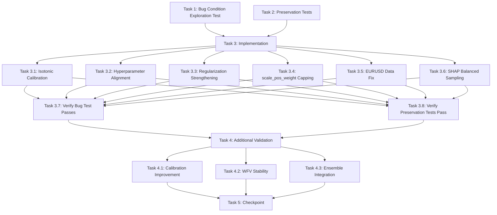

# Implementation Plan

## Overview

This implementation plan follows the bugfix workflow using the bug condition methodology. The plan is structured in three phases:

1. **Exploration Phase (Task 1)**: Write property-based test to surface the 95%+ BUY bias on unfixed code - test will FAIL (expected)
2. **Preservation Phase (Task 2)**: Write property-based tests to capture existing behavior that must be preserved - tests will PASS on unfixed code
3. **Implementation Phase (Tasks 3-5)**: Apply the fix (isotonic calibration, hyperparameter alignment, regularization strengthening, data consistency), then verify exploration test passes and preservation tests still pass

## Tasks

- [x] 1. Write bug condition exploration test
  - **Property 1: Bug Condition** - XGBoost 95%+ BUY Bias Detection
  - **CRITICAL**: This test MUST FAIL on unfixed code - failure confirms the bug exists
  - **DO NOT attempt to fix the test or the code when it fails**
  - **NOTE**: This test encodes the expected behavior - it will validate the fix when it passes after implementation
  - **GOAL**: Surface counterexamples that demonstrate the 95%+ BUY bias exists across all trading pairs
  - **Scoped PBT Approach**: Test all trading pairs (GBPUSD, XAUUSD, US30, EURUSD, USDJPY) to ensure reproducibility
  - Test that XGBoost model predictions on test data show 95%+ predictions in BUY zone (>0.6) with <5% in SELL zone (<0.4)
  - The test assertions should match the Expected Behavior Properties from design: 30-40% BUY, 30-40% SELL, 20-40% NOISE
  - Run test on UNFIXED code (before applying isotonic calibration, hyperparameter changes, or data fixes)
  - **EXPECTED OUTCOME**: Test FAILS (this is correct - it proves the bug exists)
  - Document counterexamples found:
    - GBPUSD: Expected to show ~95% BUY bias (7,590 Weak BUY + 11,195 Strong BUY out of ~19,000 predictions)
    - XAUUSD: Expected to show ~95% BUY bias (7,559 Weak BUY + 11,176 Strong BUY out of ~19,000 predictions)
    - US30: Expected to show ~96% BUY bias (11,649 Weak BUY + 7,448 Strong BUY out of ~19,000 predictions)
  - Mark task complete when test is written, run, and failure is documented
  - _Requirements: 1.1, 1.2, 1.7, 1.8, 1.9_

- [x] 2. Write preservation property tests (BEFORE implementing fix)
  - **Property 2: Preservation** - Training Pipeline Functionality Preservation
  - **IMPORTANT**: Follow observation-first methodology
  - Observe behavior on UNFIXED code for non-buggy operations:
    - Feature engineering (lagged features, rolling statistics, delta features)
    - Feature selection (SelectKBest, SHAP, RFE)
    - Model persistence (saving/loading joblib files)
    - Walk-Forward Validation (5-fold splitting and per-fold training)
    - Early stopping monitoring
    - Error handling (insufficient data, constant features)
  - Write property-based tests capturing observed behavior patterns from Preservation Requirements
  - Property-based testing generates many test cases for stronger guarantees
  - Test that feature engineering produces consistent output shapes and values
  - Test that feature selection selects features deterministically (given same random seed)
  - Test that model persistence saves and loads models correctly
  - Test that Walk-Forward Validation completes all folds and reports metrics
  - Test that early stopping triggers correctly
  - Test that error handling raises expected exceptions
  - Run tests on UNFIXED code
  - **EXPECTED OUTCOME**: Tests PASS (this confirms baseline behavior to preserve)
  - Mark task complete when tests are written, run, and passing on unfixed code
  - _Requirements: 3.1, 3.3, 3.4, 3.5, 3.6, 3.7, 3.8, 3.9, 3.10, 3.11, 3.12, 3.14, 3.15, 3.16_

- [x] 3. Fix for XGBoost 95%+ BUY Bias

  - [x] 3.1 Implement isotonic calibration in xgb_model.py
    - Modify the `train()` method in `XGBModel` class
    - After `self.model.fit()` completes, split training data: 80% for model training, 20% for calibration
    - Use `cal_split = int(len(X_train) * 0.8)` to get 80/20 split
    - Extract calibration set: `X_cal = X_train[cal_split:]` and `y_cal = y_train[cal_split:]`
    - Apply `sklearn.calibration.CalibratedClassifierCV` with `method='isotonic'` and `cv='prefit'`
    - Call existing `calibrate_model(self.model, X_cal, y_cal, symbol="TRAIN")` function
    - Replace `self.model` with the calibrated wrapper before saving
    - Log probability distribution before and after calibration (% in BUY/SELL/NOISE zones)
    - _Bug_Condition: isBugCondition(predictions) where pct_buy_zone > 0.90 AND pct_sell_zone < 0.05_
    - _Expected_Behavior: 0.30 <= pct_buy <= 0.40 AND 0.30 <= pct_sell <= 0.40 AND 0.20 <= pct_noise <= 0.40_
    - _Preservation: Training pipeline, feature engineering, model persistence unchanged_
    - _Requirements: 2.1, 2.2, 2.5, 2.6_

  - [x] 3.2 Align hyperparameters with Walk-Forward Validation
    - In `xgb_model.py` line ~680, change `n_estimators=500` to `n_estimators=300`
    - This matches the Walk-Forward Validation configuration
    - Ensures validation results accurately reflect final model performance
    - _Bug_Condition: Configuration mismatch between final model (500 trees) and WFV (300 trees)_
    - _Expected_Behavior: Final model uses n_estimators=300 matching WFV_
    - _Preservation: All other hyperparameters and training logic unchanged_
    - _Requirements: 1.3, 2.3_

  - [x] 3.3 Strengthen regularization parameters
    - In `xgb_model.py` line ~684, change `min_child_weight=20` to `min_child_weight=30`
    - In `xgb_model.py` line ~686, ensure `reg_lambda=1.5` (increase from 1.0)
    - In `xgb_model.py` line ~688, ensure `max_delta_step=1` is present
    - These changes prevent overfitting to temporal directional patterns
    - Stronger regularization forces model to focus on feature relationships rather than directional trends
    - _Bug_Condition: Insufficient regularization allows overfitting to uptrend period_
    - _Expected_Behavior: Stronger regularization prevents directional bias_
    - _Preservation: Training pipeline and feature engineering unchanged_
    - _Requirements: 2.13_

  - [x] 3.4 Cap scale_pos_weight to prevent extreme bias
    - In `xgb_model.py`, after calculating `scale_pos_weight = n_neg / n_pos`
    - Apply cap: `scale_pos_weight = min(scale_pos_weight, 1.2)`
    - Log when capping occurs to track its effect
    - This prevents extreme directional bias even when training data becomes slightly imbalanced
    - _Bug_Condition: Uncapped scale_pos_weight could amplify directional bias_
    - _Expected_Behavior: scale_pos_weight capped at 1.2 maximum_
    - _Preservation: Training pipeline unchanged_
    - _Requirements: 1.4, 2.4_

  - [x] 3.5 Fix EURUSD data volume consistency
    - In `data_loader.py` line ~40, modify `fetch_mt5_ohlc()` function
    - Ensure minimum 99,000 candles for all symbols
    - Change: `count = max(count if count else Config.DATA_POINTS, 99000)`
    - This ensures EURUSD gets the same data volume as other symbols (GBPUSD, XAUUSD, US30, USDJPY)
    - _Bug_Condition: EURUSD trained with only 20,000 candles vs 99,000 for other symbols_
    - _Expected_Behavior: EURUSD fetches minimum 99,000 candles_
    - _Preservation: Data loading logic for other symbols unchanged_
    - _Requirements: 1.11, 2.11_

  - [x] 3.6 Verify SHAP balanced sampling is working
    - In `xgb_model.py`, verify `shap_feature_selection()` function (lines 234-247)
    - Confirm balanced sampling (50% BUY, 50% SELL) when computing SHAP values
    - Ensure this logic is not being bypassed
    - Add logging to confirm equal BUY/SELL samples are used
    - _Bug_Condition: SHAP computed on biased training data reinforces directional bias_
    - _Expected_Behavior: SHAP uses balanced sampling (50% BUY, 50% SELL)_
    - _Preservation: SHAP feature selection logic unchanged_
    - _Requirements: 2.14_

  - [x] 3.7 Verify bug condition exploration test now passes
    - **Property 1: Expected Behavior** - Balanced Prediction Distribution
    - **IMPORTANT**: Re-run the SAME test from task 1 - do NOT write a new test
    - The test from task 1 encodes the expected behavior
    - When this test passes, it confirms the expected behavior is satisfied
    - Run bug condition exploration test from step 1
    - Verify predictions show 30-40% BUY, 30-40% SELL, 20-40% NOISE for all trading pairs
    - **EXPECTED OUTCOME**: Test PASSES (confirms bug is fixed)
    - _Requirements: 2.1, 2.2, 2.7, 2.8, 2.9_

  - [x] 3.8 Verify preservation tests still pass
    - **Property 2: Preservation** - Training Pipeline Functionality Preservation
    - **IMPORTANT**: Re-run the SAME tests from task 2 - do NOT write new tests
    - Run preservation property tests from step 2
    - Verify feature engineering, feature selection, model persistence, WFV, early stopping, and error handling all work identically
    - **EXPECTED OUTCOME**: Tests PASS (confirms no regressions)
    - Confirm all tests still pass after fix (no regressions)
    - _Requirements: 3.1, 3.3, 3.4, 3.5, 3.6, 3.7, 3.8, 3.9, 3.10, 3.11, 3.12, 3.14, 3.15, 3.16_

- [x] 4. Additional validation tests

  - [x] 4.1 Test calibration improvement
    - Compute calibration curve (predicted probability vs actual frequency) on test data
    - Verify calibrated probabilities match actual frequencies (well-calibrated)
    - Compare calibration curve before and after fix
    - Expected: Calibration error reduced from >0.2 to <0.1
    - _Requirements: 2.5_

  - [x] 4.2 Test Walk-Forward Validation stability
    - Run WFV on USDJPY with fixed model
    - Verify all fold accuracies within 3-5% of mean
    - Compare with unfixed model (Fold 3 at 53%, high variance)
    - Expected: All folds between 55-62%, std < 3%
    - _Requirements: 1.12, 2.12_

  - [x] 4.3 Test ensemble integration
    - Load calibrated XGBoost model in ensemble engine
    - Verify predictions integrate correctly with Random Forest predictions
    - Test that ensemble decision logic works with calibrated probabilities
    - Verify prediction interface returns probability 0.0-1.0 for BUY class
    - _Requirements: 3.13_

- [x] 5. Checkpoint - Ensure all tests pass
  - Run all bug condition exploration tests (task 1) - should now PASS
  - Run all preservation tests (task 2) - should still PASS
  - Run all additional validation tests (task 4) - should PASS
  - Verify no regressions in existing functionality
  - Ask the user if questions arise

## Task Dependency Graph

```json
{
  "waves": [
    {
      "name": "Exploration & Preservation",
      "tasks": ["1", "2"]
    },
    {
      "name": "Implementation",
      "tasks": ["3.1", "3.2", "3.3", "3.4", "3.5", "3.6"]
    },
    {
      "name": "Verification",
      "tasks": ["3.7", "3.8"]
    },
    {
      "name": "Additional Validation",
      "tasks": ["4.1", "4.2", "4.3"]
    },
    {
      "name": "Checkpoint",
      "tasks": ["5"]
    }
  ]
}
```



## Notes

- **Critical**: Task 1 (exploration test) MUST be written and run BEFORE implementing the fix. The test is expected to FAIL on unfixed code - this confirms the bug exists.
- **Critical**: Task 2 (preservation tests) MUST be written and run BEFORE implementing the fix. These tests are expected to PASS on unfixed code - this establishes the baseline behavior to preserve.
- **Property-Based Testing**: Tasks 1 and 2 use the **Property N:** format to enable hover status tracking in the IDE.
- **Test Reuse**: Tasks 3.7 and 3.8 re-run the SAME tests from tasks 1 and 2 - do NOT write new tests.
- **Implementation Order**: All implementation subtasks (3.1-3.6) can be done in parallel, but must be completed before verification tasks (3.7-3.8).
- **Files Modified**: `xgb_model.py` (isotonic calibration, hyperparameters, regularization, scale_pos_weight capping, SHAP verification) and `data_loader.py` (EURUSD data volume fix).
- **Testing Strategy**: Follow the observation-first methodology for preservation tests - observe behavior on unfixed code first, then write tests capturing that behavior.
